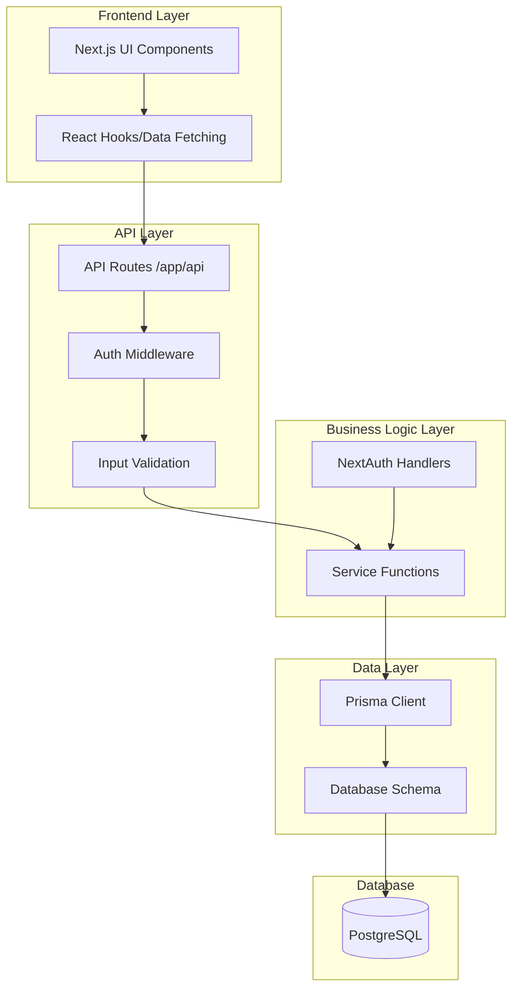

# Design Document: Backend API and Database Integration

## Overview

This design document outlines the architecture and implementation details for building a complete backend system for the Velonx student community platform. The system will replace mock data with a PostgreSQL database managed through Prisma ORM, expose REST API endpoints via Next.js App Router, and integrate with the existing NextAuth authentication system.

The backend will support:
- **Database Layer**: PostgreSQL with Prisma ORM for type-safe database access
- **API Layer**: Next.js API routes (App Router) with authentication middleware
- **Authentication**: Integration with existing NextAuth setup (Google, GitHub, Credentials)
- **Authorization**: Role-based access control (Student, Admin)
- **Data Operations**: Full CRUD operations for all platform entities
- **Performance**: Pagination, filtering, sorting, and database optimization
- **Type Safety**: End-to-end TypeScript types from database to frontend

## Architecture

### High-Level Architecture



### Technology Stack

- **Database**: MongoDB Atlas or local MongoDB instance
- **ORM**: Prisma 5.x with MongoDB connector
- **API Framework**: Next.js 16 App Router
- **Authentication**: NextAuth.js v5
- **Validation**: Zod for schema validation
- **TypeScript**: Strict mode enabled
- **Runtime**: Node.js 18+

### Directory Structure

```
src/
├── app/
│   ├── api/
│   │   ├── auth/
│   │   │   └── [...nextauth]/
│   │   │       └── route.ts
│   │   ├── users/
│   │   │   ├── route.ts
│   │   │   └── [id]/
│   │   │       └── route.ts
│   │   ├── events/
│   │   │   ├── route.ts
│   │   │   ├── [id]/
│   │   │   │   └── route.ts
│   │   │   └── [id]/
│   │   │       └── register/
│   │   │           └── route.ts
│   │   ├── projects/
│   │   ├── mentors/
│   │   ├── resources/
│   │   ├── blog/
│   │   ├── leaderboard/
│   │   ├── meetings/
│   │   └── admin/
│   └── ...
├── lib/
│   ├── prisma.ts
│   ├── auth.ts
│   ├── validations/
│   │   ├── user.ts
│   │   ├── event.ts
│   │   └── ...
│   ├── services/
│   │   ├── user.service.ts
│   │   ├── event.service.ts
│   │   └── ...
│   └── middleware/
│       ├── auth.middleware.ts
│       └── error.middleware.ts
├── types/
│   ├── api.ts
│   └── database.ts
└── prisma/
    ├── schema.prisma
    ├── migrations/
    └── seed.ts
```

## Components and Interfaces

### Database Schema (Prisma with MongoDB)

#### Prisma Schema Configuration

```prisma
// prisma/schema.prisma
generator client {
  provider = "prisma-client-js"
}

datasource db {
  provider = "mongodb"
  url      = env("DATABASE_URL")
}
```

#### User Model

```prisma
model User {
  id            String    @id @default(auto()) @map("_id") @db.ObjectId
  name          String?
  email         String    @unique
  emailVerified DateTime?
  image         String?
  password      String?   // For credential-based auth
  role          UserRole  @default(STUDENT)
  bio           String?
  xp            Int       @default(0)
  level         Int       @default(1)
  createdAt     DateTime  @default(now())
  updatedAt     DateTime  @updatedAt
  
  // Relations
  accounts         Account[]
  sessions         Session[]
  eventsCreated    Event[]   @relation("EventCreator")
  eventsAttending  EventAttendee[]
  projectsOwned    Project[] @relation("ProjectOwner")
  projectMembers   ProjectMember[]
  blogPosts        BlogPost[]
  meetingsCreated  Meeting[] @relation("MeetingCreator")
  meetingAttendees MeetingAttendee[]
  userRequests     UserRequest[]
  
  @@map("users")
}

enum UserRole {
  STUDENT
  ADMIN
}
```

#### Event Model

```prisma
model Event {
  id          String      @id @default(auto()) @map("_id") @db.ObjectId
  title       String
  description String
  type        EventType
  date        DateTime
  endDate     DateTime?
  location    String?
  imageUrl    String?
  maxSeats    Int
  status      EventStatus @default(UPCOMING)
  creatorId   String      @db.ObjectId
  createdAt   DateTime    @default(now())
  updatedAt   DateTime    @updatedAt
  
  // Relations
  creator     User            @relation("EventCreator", fields: [creatorId], references: [id], onDelete: Cascade)
  attendees   EventAttendee[]
  
  @@map("events")
}

enum EventType {
  HACKATHON
  WORKSHOP
  WEBINAR
}

enum EventStatus {
  UPCOMING
  ONGOING
  COMPLETED
  CANCELLED
}

model EventAttendee {
  id        String         @id @default(auto()) @map("_id") @db.ObjectId
  eventId   String         @db.ObjectId
  userId    String         @db.ObjectId
  status    AttendeeStatus @default(REGISTERED)
  createdAt DateTime       @default(now())
  
  event Event @relation(fields: [eventId], references: [id], onDelete: Cascade)
  user  User  @relation(fields: [userId], references: [id], onDelete: Cascade)
  
  @@unique([eventId, userId])
  @@map("event_attendees")
}

enum AttendeeStatus {
  REGISTERED
  ATTENDED
  CANCELLED
}
```

#### Project Model

```prisma
model Project {
  id          String        @id @default(auto()) @map("_id") @db.ObjectId
  title       String
  description String
  techStack   String[]
  status      ProjectStatus @default(PLANNING)
  imageUrl    String?
  githubUrl   String?
  liveUrl     String?
  outcomes    String?
  ownerId     String        @db.ObjectId
  createdAt   DateTime      @default(now())
  updatedAt   DateTime      @updatedAt
  
  // Relations
  owner   User            @relation("ProjectOwner", fields: [ownerId], references: [id], onDelete: Cascade)
  members ProjectMember[]
  
  @@map("projects")
}

enum ProjectStatus {
  PLANNING
  IN_PROGRESS
  COMPLETED
  ARCHIVED
}

model ProjectMember {
  id        String   @id @default(auto()) @map("_id") @db.ObjectId
  projectId String   @db.ObjectId
  userId    String   @db.ObjectId
  role      String?
  joinedAt  DateTime @default(now())
  
  project Project @relation(fields: [projectId], references: [id], onDelete: Cascade)
  user    User    @relation(fields: [userId], references: [id], onDelete: Cascade)
  
  @@unique([projectId, userId])
  @@map("project_members")
}
```

#### Mentor Model

```prisma
model Mentor {
  id            String   @id @default(auto()) @map("_id") @db.ObjectId
  name          String
  email         String   @unique
  expertise     String[]
  company       String
  bio           String
  imageUrl      String?
  rating        Float    @default(0)
  totalSessions Int      @default(0)
  available     Boolean  @default(true)
  createdAt     DateTime @default(now())
  updatedAt     DateTime @updatedAt
  
  @@map("mentors")
}
```

#### Resource Model

```prisma
model Resource {
  id          String           @id @default(auto()) @map("_id") @db.ObjectId
  title       String
  description String
  category    ResourceCategory
  type        ResourceType
  url         String
  imageUrl    String?
  accessCount Int              @default(0)
  createdAt   DateTime         @default(now())
  updatedAt   DateTime         @updatedAt
  
  @@map("resources")
}

enum ResourceCategory {
  PROGRAMMING
  DESIGN
  BUSINESS
  DATA_SCIENCE
  DEVOPS
  MOBILE
  WEB
  OTHER
}

enum ResourceType {
  ARTICLE
  VIDEO
  COURSE
  BOOK
  TOOL
  DOCUMENTATION
}
```

#### BlogPost Model

```prisma
model BlogPost {
  id          String     @id @default(auto()) @map("_id") @db.ObjectId
  title       String
  content     String
  excerpt     String?
  imageUrl    String?
  tags        String[]
  status      PostStatus @default(DRAFT)
  authorId    String     @db.ObjectId
  publishedAt DateTime?
  createdAt   DateTime   @default(now())
  updatedAt   DateTime   @updatedAt
  
  // Relations
  author User @relation(fields: [authorId], references: [id], onDelete: Cascade)
  
  @@map("blog_posts")
}

enum PostStatus {
  DRAFT
  PUBLISHED
}
```

#### Meeting Model

```prisma
model Meeting {
  id          String            @id @default(auto()) @map("_id") @db.ObjectId
  title       String
  description String?
  date        DateTime
  duration    Int               // in minutes
  platform    String
  meetingLink String?
  creatorId   String            @db.ObjectId
  createdAt   DateTime          @default(now())
  updatedAt   DateTime          @updatedAt
  
  // Relations
  creator   User              @relation("MeetingCreator", fields: [creatorId], references: [id], onDelete: Cascade)
  attendees MeetingAttendee[]
  
  @@map("meetings")
}

model MeetingAttendee {
  id        String                @id @default(auto()) @map("_id") @db.ObjectId
  meetingId String                @db.ObjectId
  userId    String                @db.ObjectId
  status    MeetingAttendeeStatus @default(INVITED)
  createdAt DateTime              @default(now())
  
  meeting Meeting @relation(fields: [meetingId], references: [id], onDelete: Cascade)
  user    User    @relation(fields: [userId], references: [id], onDelete: Cascade)
  
  @@unique([meetingId, userId])
  @@map("meeting_attendees")
}

enum MeetingAttendeeStatus {
  INVITED
  ACCEPTED
  DECLINED
  ATTENDED
}
```

#### UserRequest Model

```prisma
model UserRequest {
  id         String        @id @default(auto()) @map("_id") @db.ObjectId
  userId     String        @db.ObjectId
  type       RequestType
  status     RequestStatus @default(PENDING)
  reason     String?
  reviewedBy String?
  reviewedAt DateTime?
  createdAt  DateTime      @default(now())
  updatedAt  DateTime      @updatedAt
  
  // Relations
  user User @relation(fields: [userId], references: [id], onDelete: Cascade)
  
  @@map("user_requests")
}

enum RequestType {
  ACCOUNT_APPROVAL
  PROJECT_SUBMISSION
  MENTOR_APPLICATION
}

enum RequestStatus {
  PENDING
  APPROVED
  REJECTED
}
```

#### NextAuth Models (Required by NextAuth with MongoDB)

```prisma
model Account {
  id                String  @id @default(auto()) @map("_id") @db.ObjectId
  userId            String  @db.ObjectId
  type              String
  provider          String
  providerAccountId String
  refresh_token     String?
  access_token      String?
  expires_at        Int?
  token_type        String?
  scope             String?
  id_token          String?
  session_state     String?

  user User @relation(fields: [userId], references: [id], onDelete: Cascade)

  @@unique([provider, providerAccountId])
  @@map("accounts")
}

model Session {
  id           String   @id @default(auto()) @map("_id") @db.ObjectId
  sessionToken String   @unique
  userId       String   @db.ObjectId
  expires      DateTime
  
  user User @relation(fields: [userId], references: [id], onDelete: Cascade)

  @@map("sessions")
}

model VerificationToken {
  id         String   @id @default(auto()) @map("_id") @db.ObjectId
  identifier String
  token      String   @unique
  expires    DateTime

  @@unique([identifier, token])
  @@map("verification_tokens")
}
```

### API Endpoints

#### Authentication Endpoints

- `POST /api/auth/signin` - Sign in with credentials
- `POST /api/auth/signout` - Sign out
- `GET /api/auth/session` - Get current session
- `POST /api/auth/signup` - Register new user

#### User Endpoints

- `GET /api/users` - List users (Admin only, paginated)
- `GET /api/users/[id]` - Get user profile
- `PATCH /api/users/[id]` - Update user profile
- `GET /api/users/[id]/stats` - Get user statistics

#### Event Endpoints

- `GET /api/events` - List events (paginated, filterable)
- `POST /api/events` - Create event (Admin only)
- `GET /api/events/[id]` - Get event details
- `PATCH /api/events/[id]` - Update event (Admin only)
- `DELETE /api/events/[id]` - Delete event (Admin only)
- `POST /api/events/[id]/register` - Register for event
- `DELETE /api/events/[id]/register` - Unregister from event

#### Project Endpoints

- `GET /api/projects` - List projects (paginated, filterable)
- `POST /api/projects` - Create project
- `GET /api/projects/[id]` - Get project details
- `PATCH /api/projects/[id]` - Update project (Owner/Admin)
- `DELETE /api/projects/[id]` - Delete project (Owner/Admin)
- `POST /api/projects/[id]/members` - Add project member
- `DELETE /api/projects/[id]/members/[userId]` - Remove member

#### Mentor Endpoints

- `GET /api/mentors` - List mentors (paginated, filterable)
- `POST /api/mentors` - Create mentor profile (Admin only)
- `GET /api/mentors/[id]` - Get mentor details
- `PATCH /api/mentors/[id]` - Update mentor (Admin only)
- `DELETE /api/mentors/[id]` - Delete mentor (Admin only)

#### Resource Endpoints

- `GET /api/resources` - List resources (paginated, filterable)
- `POST /api/resources` - Create resource (Admin only)
- `GET /api/resources/[id]` - Get resource details
- `PATCH /api/resources/[id]` - Update resource (Admin only)
- `DELETE /api/resources/[id]` - Delete resource (Admin only)
- `POST /api/resources/[id]/access` - Track resource access

#### Blog Endpoints

- `GET /api/blog` - List blog posts (paginated, filterable)
- `POST /api/blog` - Create blog post (Admin only)
- `GET /api/blog/[id]` - Get blog post
- `PATCH /api/blog/[id]` - Update blog post (Author/Admin)
- `DELETE /api/blog/[id]` - Delete blog post (Author/Admin)

#### Leaderboard Endpoints

- `GET /api/leaderboard` - Get leaderboard (paginated, filterable)
- `POST /api/leaderboard/award-xp` - Award XP to user (Admin only)

#### Meeting Endpoints

- `GET /api/meetings` - List meetings (paginated, filterable)
- `POST /api/meetings` - Create meeting
- `GET /api/meetings/[id]` - Get meeting details
- `PATCH /api/meetings/[id]` - Update meeting (Creator/Admin)
- `DELETE /api/meetings/[id]` - Delete meeting (Creator/Admin)
- `POST /api/meetings/[id]/attendees` - Add attendee
- `PATCH /api/meetings/[id]/attendees/[userId]` - Update attendee status

#### Admin Endpoints

- `GET /api/admin/requests` - List user requests (Admin only)
- `PATCH /api/admin/requests/[id]` - Approve/reject request (Admin only)
- `GET /api/admin/stats` - Get platform statistics (Admin only)

### API Response Formats

#### Success Response

```typescript
interface SuccessResponse<T> {
  success: true;
  data: T;
  message?: string;
}
```

#### List Response with Pagination

```typescript
interface PaginatedResponse<T> {
  success: true;
  data: T[];
  pagination: {
    page: number;
    pageSize: number;
    totalCount: number;
    totalPages: number;
  };
}
```

#### Error Response

```typescript
interface ErrorResponse {
  success: false;
  error: {
    code: string;
    message: string;
    details?: Record<string, any>;
  };
}
```

### Validation Schemas (Zod)

#### User Validation

```typescript
import { z } from 'zod';

export const createUserSchema = z.object({
  name: z.string().min(2).max(100),
  email: z.string().email(),
  password: z.string().min(8).max(100).optional(),
  role: z.enum(['STUDENT', 'ADMIN']).default('STUDENT'),
  bio: z.string().max(500).optional(),
});

export const updateUserSchema = z.object({
  name: z.string().min(2).max(100).optional(),
  bio: z.string().max(500).optional(),
  image: z.string().url().optional(),
});
```

#### Event Validation

```typescript
export const createEventSchema = z.object({
  title: z.string().min(3).max(200),
  description: z.string().min(10),
  type: z.enum(['HACKATHON', 'WORKSHOP', 'WEBINAR']),
  date: z.string().datetime(),
  endDate: z.string().datetime().optional(),
  location: z.string().max(200).optional(),
  imageUrl: z.string().url().optional(),
  maxSeats: z.number().int().positive(),
});

export const updateEventSchema = createEventSchema.partial();
```

#### Project Validation

```typescript
export const createProjectSchema = z.object({
  title: z.string().min(3).max(200),
  description: z.string().min(10),
  techStack: z.array(z.string()).min(1),
  status: z.enum(['PLANNING', 'IN_PROGRESS', 'COMPLETED', 'ARCHIVED']).default('PLANNING'),
  imageUrl: z.string().url().optional(),
  githubUrl: z.string().url().optional(),
  liveUrl: z.string().url().optional(),
});

export const updateProjectSchema = createProjectSchema.partial();
```

### Authentication Middleware

```typescript
// lib/middleware/auth.middleware.ts
import { getServerSession } from 'next-auth';
import { authOptions } from '@/lib/auth';
import { NextRequest, NextResponse } from 'next/server';

export async function requireAuth(request: NextRequest) {
  const session = await getServerSession(authOptions);
  
  if (!session || !session.user) {
    return NextResponse.json(
      { success: false, error: { code: 'UNAUTHORIZED', message: 'Authentication required' } },
      { status: 401 }
    );
  }
  
  return session;
}

export async function requireAdmin(request: NextRequest) {
  const session = await requireAuth(request);
  
  if (session instanceof NextResponse) {
    return session; // Return error response
  }
  
  if (session.user.role !== 'ADMIN') {
    return NextResponse.json(
      { success: false, error: { code: 'FORBIDDEN', message: 'Admin access required' } },
      { status: 403 }
    );
  }
  
  return session;
}
```

### Service Layer Pattern

```typescript
// lib/services/event.service.ts
import { prisma } from '@/lib/prisma';
import { Prisma } from '@prisma/client';

export class EventService {
  async listEvents(params: {
    page?: number;
    pageSize?: number;
    type?: string;
    status?: string;
    startDate?: Date;
    endDate?: Date;
  }) {
    const { page = 1, pageSize = 10, type, status, startDate, endDate } = params;
    
    const where: Prisma.EventWhereInput = {};
    
    if (type) where.type = type as any;
    if (status) where.status = status as any;
    if (startDate || endDate) {
      where.date = {};
      if (startDate) where.date.gte = startDate;
      if (endDate) where.date.lte = endDate;
    }
    
    const [events, totalCount] = await Promise.all([
      prisma.event.findMany({
        where,
        include: {
          creator: { select: { id: true, name: true, image: true } },
          _count: { select: { attendees: true } },
        },
        skip: (page - 1) * pageSize,
        take: pageSize,
        orderBy: { date: 'asc' },
      }),
      prisma.event.count({ where }),
    ]);
    
    return {
      events,
      pagination: {
        page,
        pageSize,
        totalCount,
        totalPages: Math.ceil(totalCount / pageSize),
      },
    };
  }
  
  async getEventById(id: string) {
    return prisma.event.findUnique({
      where: { id },
      include: {
        creator: { select: { id: true, name: true, image: true } },
        attendees: {
          include: {
            user: { select: { id: true, name: true, image: true } },
          },
        },
      },
    });
  }
  
  async createEvent(data: Prisma.EventCreateInput) {
    return prisma.event.create({
      data,
      include: {
        creator: { select: { id: true, name: true, image: true } },
      },
    });
  }
  
  async updateEvent(id: string, data: Prisma.EventUpdateInput) {
    return prisma.event.update({
      where: { id },
      data,
      include: {
        creator: { select: { id: true, name: true, image: true } },
      },
    });
  }
  
  async deleteEvent(id: string) {
    return prisma.event.delete({ where: { id } });
  }
  
  async registerForEvent(eventId: string, userId: string) {
    // Check if event exists and has available seats
    const event = await prisma.event.findUnique({
      where: { id: eventId },
      include: { _count: { select: { attendees: true } } },
    });
    
    if (!event) {
      throw new Error('Event not found');
    }
    
    if (event._count.attendees >= event.maxSeats) {
      throw new Error('Event is full');
    }
    
    // Check if already registered
    const existing = await prisma.eventAttendee.findUnique({
      where: {
        eventId_userId: { eventId, userId },
      },
    });
    
    if (existing) {
      throw new Error('Already registered for this event');
    }
    
    return prisma.eventAttendee.create({
      data: {
        eventId,
        userId,
        status: 'REGISTERED',
      },
    });
  }
  
  async unregisterFromEvent(eventId: string, userId: string) {
    return prisma.eventAttendee.delete({
      where: {
        eventId_userId: { eventId, userId },
      },
    });
  }
}

export const eventService = new EventService();
```

### Prisma Client Setup

```typescript
// lib/prisma.ts
import { PrismaClient } from '@prisma/client';

const globalForPrisma = globalThis as unknown as {
  prisma: PrismaClient | undefined;
};

export const prisma =
  globalForPrisma.prisma ??
  new PrismaClient({
    log: process.env.NODE_ENV === 'development' ? ['query', 'error', 'warn'] : ['error'],
  });

if (process.env.NODE_ENV !== 'production') globalForPrisma.prisma = prisma;
```

### NextAuth Configuration

```typescript
// lib/auth.ts
import { NextAuthOptions } from 'next-auth';
import GoogleProvider from 'next-auth/providers/google';
import GitHubProvider from 'next-auth/providers/github';
import CredentialsProvider from 'next-auth/providers/credentials';
import { PrismaAdapter } from '@auth/prisma-adapter';
import { prisma } from './prisma';
import bcrypt from 'bcryptjs';

export const authOptions: NextAuthOptions = {
  adapter: PrismaAdapter(prisma),
  providers: [
    GoogleProvider({
      clientId: process.env.GOOGLE_CLIENT_ID!,
      clientSecret: process.env.GOOGLE_CLIENT_SECRET!,
    }),
    GitHubProvider({
      clientId: process.env.GITHUB_ID!,
      clientSecret: process.env.GITHUB_SECRET!,
    }),
    CredentialsProvider({
      name: 'Credentials',
      credentials: {
        email: { label: 'Email', type: 'email' },
        password: { label: 'Password', type: 'password' },
      },
      async authorize(credentials) {
        if (!credentials?.email || !credentials?.password) {
          return null;
        }
        
        const user = await prisma.user.findUnique({
          where: { email: credentials.email },
        });
        
        if (!user || !user.password) {
          return null;
        }
        
        const isValid = await bcrypt.compare(credentials.password, user.password);
        
        if (!isValid) {
          return null;
        }
        
        return {
          id: user.id,
          email: user.email,
          name: user.name,
          image: user.image,
          role: user.role,
        };
      },
    }),
  ],
  callbacks: {
    async session({ session, token }) {
      if (token && session.user) {
        session.user.id = token.sub!;
        session.user.role = token.role as string;
      }
      return session;
    },
    async jwt({ token, user }) {
      if (user) {
        token.role = user.role;
      }
      return token;
    },
  },
  session: {
    strategy: 'jwt',
  },
  pages: {
    signIn: '/auth/signin',
    error: '/auth/error',
  },
};
```

## Data Models

The data models are defined in the Prisma schema above. Key relationships:

1. **User ↔ Events**: Many-to-many through EventAttendee
2. **User ↔ Projects**: Many-to-many through ProjectMember, plus one-to-many for ownership
3. **User ↔ Meetings**: Many-to-many through MeetingAttendee
4. **User ↔ BlogPosts**: One-to-many (author relationship)
5. **User ↔ UserRequests**: One-to-many

### XP and Level Calculation

```typescript
// lib/utils/xp.ts
export const XP_THRESHOLDS = [
  0,     // Level 1
  100,   // Level 2
  250,   // Level 3
  500,   // Level 4
  1000,  // Level 5
  2000,  // Level 6
  3500,  // Level 7
  5500,  // Level 8
  8000,  // Level 9
  11000, // Level 10
];

export function calculateLevel(xp: number): number {
  for (let i = XP_THRESHOLDS.length - 1; i >= 0; i--) {
    if (xp >= XP_THRESHOLDS[i]) {
      return i + 1;
    }
  }
  return 1;
}

export const XP_REWARDS = {
  EVENT_ATTENDANCE: 50,
  PROJECT_COMPLETION: 100,
  BLOG_POST_PUBLISHED: 75,
  MENTOR_SESSION: 25,
  RESOURCE_CONTRIBUTION: 30,
};

export async function awardXP(userId: string, amount: number, reason: string) {
  const user = await prisma.user.update({
    where: { id: userId },
    data: {
      xp: { increment: amount },
    },
  });
  
  const newLevel = calculateLevel(user.xp);
  
  if (newLevel !== user.level) {
    await prisma.user.update({
      where: { id: userId },
      data: { level: newLevel },
    });
  }
  
  return { xp: user.xp, level: newLevel };
}
```


## Correctness Properties

*A property is a characteristic or behavior that should hold true across all valid executions of a system—essentially, a formal statement about what the system should do. Properties serve as the bridge between human-readable specifications and machine-verifiable correctness guarantees.*

### Property Reflection

After analyzing all acceptance criteria, I identified several areas of redundancy:

1. **Pagination properties** (3.3, 4.6, 5.3, 6.4, 7.5, 8.3, 9.5) can be combined into a single comprehensive pagination property
2. **Filtering properties** (3.2, 4.5, 5.2, 6.3, 7.4, 8.7, 9.4) can be combined into a single filtering property
3. **Input validation properties** (3.7, 4.2, 5.5, 6.6, 7.2, 9.2, 12.2, 12.3) can be combined into a comprehensive validation property
4. **Authorization properties** (4.8, 5.8, 6.8, 7.7, 9.8, 10.3, 10.7, 11.6, 11.7) can be combined into role-based access control properties
5. **Response format properties** (13.1, 13.2, 13.3, 13.4, 13.6, 13.7, 13.8) can be combined into API response consistency properties

### Core Properties

#### Property 1: Default Role Assignment
*For any* new user registration, the user should be assigned the STUDENT role by default unless explicitly specified otherwise.

**Validates: Requirements 2.4**

#### Property 2: Session Data Completeness
*For any* authenticated user session, the session data should include user ID, role, and all necessary permission information.

**Validates: Requirements 2.6**

#### Property 3: Profile Update Round-Trip
*For any* valid user profile update, retrieving the profile immediately after the update should reflect all the changes that were submitted.

**Validates: Requirements 2.8**

#### Property 4: Authorization Boundary
*For any* user attempting to modify another user's profile, the operation should be rejected unless the requesting user has the ADMIN role.

**Validates: Requirements 2.9**

#### Property 5: Universal Pagination
*For any* list endpoint (events, projects, mentors, resources, blog posts, leaderboard, meetings) and any valid page number and page size, the response should include exactly pageSize items (or fewer on the last page) and correct pagination metadata (page, pageSize, totalCount, totalPages).

**Validates: Requirements 3.3, 4.6, 5.3, 6.4, 7.5, 8.3, 9.5, 14.4**

#### Property 6: Universal Filtering
*For any* list endpoint that supports filtering and any valid filter criteria, all returned results should match the specified filter conditions (type, status, date range, category, author, etc.).

**Validates: Requirements 3.2, 4.5, 5.2, 6.3, 7.4, 8.7, 9.4**

#### Property 7: Event Registration with Available Seats
*For any* event with available seats and any authenticated student user, registering for the event should add the user to the attendees list and decrease available seats by one.

**Validates: Requirements 3.4**

#### Property 8: Event Capacity Enforcement
*For any* event at maximum capacity, attempting to register an additional user should be rejected with an appropriate error message.

**Validates: Requirements 3.5** (edge case)

#### Property 9: Event Response Completeness
*For any* event detail response, the data should include the current attendee count and the number of available seats (maxSeats - attendeeCount).

**Validates: Requirements 3.9**

#### Property 10: Universal Input Validation
*For any* create or update endpoint and any input data with missing required fields, invalid data types, incorrect formats, or values exceeding maximum length constraints, the API should return 400 Bad Request with specific validation error messages.

**Validates: Requirements 3.7, 4.2, 5.5, 6.6, 7.2, 9.2, 12.1, 12.2, 12.3, 12.7, 12.8, 12.9**

#### Property 11: Project Member Addition
*For any* project and any authenticated user, adding the user as a project member should result in the user appearing in the project's members list.

**Validates: Requirements 4.7**

#### Property 12: Project Completion Outcomes
*For any* project that is marked as COMPLETED, the project record should include stored outcomes and results data.

**Validates: Requirements 4.9**

#### Property 13: Role-Based Resource Access
*For any* admin-only endpoint (creating events, mentors, resources, blog posts, or managing user requests) and any non-admin user, the request should be rejected with 403 Forbidden.

**Validates: Requirements 4.8, 5.8, 6.8, 7.7, 9.8, 10.3, 10.7, 11.6**

#### Property 14: Owner Resource Access
*For any* user-owned resource (profile, authored blog post, created project, created meeting) and the owning user, the user should be able to read and update their own resource.

**Validates: Requirements 11.7**

#### Property 15: Mentor Rating Calculation
*For any* mentor with student feedback ratings, the mentor's displayed rating should equal the arithmetic mean of all feedback ratings.

**Validates: Requirements 5.6**

#### Property 16: Mentor Session Count
*For any* mentor detail response, the data should include the total number of sessions conducted by that mentor.

**Validates: Requirements 5.7**

#### Property 17: Resource Access Tracking
*For any* resource, each time the resource is accessed, the access count should increment by exactly one.

**Validates: Requirements 6.7**

#### Property 18: Draft Post Visibility
*For any* non-admin user retrieving blog posts, the results should exclude all posts with DRAFT status.

**Validates: Requirements 7.8**

#### Property 19: Leaderboard Ordering
*For any* leaderboard query, the results should be ordered by XP in descending order, with the highest XP user ranked first.

**Validates: Requirements 8.2**

#### Property 20: XP Award Consistency
*For any* user completing an action (event attendance, project completion, blog post publication, mentor session, resource contribution), the user should be awarded the correct XP amount based on the action type.

**Validates: Requirements 8.4**

#### Property 21: Level Calculation from XP
*For any* user with a given XP value, the user's level should be calculated correctly based on the XP thresholds (level N if XP >= threshold[N] and XP < threshold[N+1]).

**Validates: Requirements 8.5**

#### Property 22: Leaderboard Entry Completeness
*For any* leaderboard entry, the response should include rank, name, XP, level, role, and project count for each user.

**Validates: Requirements 8.6**

#### Property 23: Ranking Consistency
*For any* change to a user's XP, the leaderboard rankings should be recalculated to reflect the new XP values in the next query.

**Validates: Requirements 8.8**

#### Property 24: Meeting Attendee Addition
*For any* meeting and any user invited to the meeting, the user should be added to the meeting's attendees list with INVITED status.

**Validates: Requirements 9.7**

#### Property 25: User Request Creation on Registration
*For any* new user registration, the system should automatically create a pending approval request of type ACCOUNT_APPROVAL.

**Validates: Requirements 10.2**

#### Property 26: Request Approval Effect
*For any* pending user approval request, when an admin approves the request, the associated user account should be activated and the request status should change to APPROVED.

**Validates: Requirements 10.4**

#### Property 27: Request Rejection Effect
*For any* pending user approval request, when an admin rejects the request with a reason, the request status should change to REJECTED and the reason should be stored.

**Validates: Requirements 10.5**

#### Property 28: Moderation Action Logging
*For any* content moderation action (delete or hide), the system should create a log entry with the action timestamp and the admin user reference.

**Validates: Requirements 10.8**

#### Property 29: Authentication Verification
*For any* protected API endpoint and any request without valid authentication, the API should return 401 Unauthorized before processing the request.

**Validates: Requirements 11.2, 11.3**

#### Property 30: Authorization Verification
*For any* role-protected API endpoint and any authenticated request where the user's role does not match the required permissions, the API should return 403 Forbidden.

**Validates: Requirements 11.4, 11.5**

#### Property 31: Rate Limiting
*For any* user making excessive API requests beyond the rate limit threshold, subsequent requests should be throttled or rejected with 429 Too Many Requests.

**Validates: Requirements 11.8**

#### Property 32: Resource Not Found
*For any* API request for a non-existent resource ID, the API should return 404 Not Found.

**Validates: Requirements 12.6**

#### Property 33: JSON Response Format
*For any* API endpoint response, the response should be valid JSON with proper Content-Type: application/json header.

**Validates: Requirements 13.1, 13.8**

#### Property 34: Success Status Codes
*For any* successful API operation, the response should include the appropriate HTTP status code: 200 for successful reads/updates, 201 for successful creates, 204 for successful deletes.

**Validates: Requirements 13.2**

#### Property 35: Paginated Response Structure
*For any* paginated list response, the response should include a data array containing the items and a pagination object with page, pageSize, totalCount, and totalPages fields.

**Validates: Requirements 13.3, 13.4**

#### Property 36: ISO 8601 Timestamps
*For any* API response containing timestamp fields (createdAt, updatedAt, publishedAt, date), the timestamps should be formatted in ISO 8601 format.

**Validates: Requirements 13.6**

#### Property 37: Error Response Structure
*For any* API error response, the response should include an error object with code, message, and optional details fields.

**Validates: Requirements 13.7**

#### Property 38: Frontend API Integration
*For any* component that previously used mock data, the component should fetch data from the corresponding API endpoint instead of importing mock data.

**Validates: Requirements 15.2**

#### Property 39: Cache Revalidation on Mutation
*For any* data mutation operation (create, update, delete), the system should revalidate any cached data related to the mutated resource.

**Validates: Requirements 15.7**

## Error Handling

### Error Categories

1. **Validation Errors (400 Bad Request)**
   - Missing required fields
   - Invalid data types
   - Format violations (email, date, URL)
   - Length constraint violations
   - Business rule violations (e.g., event capacity)

2. **Authentication Errors (401 Unauthorized)**
   - Missing authentication token
   - Invalid or expired session
   - Invalid credentials

3. **Authorization Errors (403 Forbidden)**
   - Insufficient permissions for operation
   - Attempting to access another user's resources
   - Non-admin accessing admin-only endpoints

4. **Not Found Errors (404 Not Found)**
   - Resource ID does not exist
   - Endpoint does not exist

5. **Rate Limiting Errors (429 Too Many Requests)**
   - Exceeded request rate limit
   - Temporary throttling

6. **Server Errors (500 Internal Server Error)**
   - Database connection failures
   - Unexpected exceptions
   - Third-party service failures

### Error Response Format

```typescript
interface ErrorResponse {
  success: false;
  error: {
    code: string;
    message: string;
    details?: {
      field?: string;
      constraint?: string;
      [key: string]: any;
    };
  };
}
```

### Error Handling Implementation

```typescript
// lib/utils/errors.ts
export class AppError extends Error {
  constructor(
    public statusCode: number,
    public code: string,
    message: string,
    public details?: Record<string, any>
  ) {
    super(message);
    this.name = 'AppError';
  }
}

export class ValidationError extends AppError {
  constructor(message: string, details?: Record<string, any>) {
    super(400, 'VALIDATION_ERROR', message, details);
  }
}

export class AuthenticationError extends AppError {
  constructor(message: string = 'Authentication required') {
    super(401, 'UNAUTHORIZED', message);
  }
}

export class AuthorizationError extends AppError {
  constructor(message: string = 'Insufficient permissions') {
    super(403, 'FORBIDDEN', message);
  }
}

export class NotFoundError extends AppError {
  constructor(resource: string) {
    super(404, 'NOT_FOUND', `${resource} not found`);
  }
}

export class RateLimitError extends AppError {
  constructor(message: string = 'Too many requests') {
    super(429, 'RATE_LIMIT_EXCEEDED', message);
  }
}

// Error handler middleware
export function handleError(error: unknown): Response {
  console.error('API Error:', error);
  
  if (error instanceof AppError) {
    return NextResponse.json(
      {
        success: false,
        error: {
          code: error.code,
          message: error.message,
          details: error.details,
        },
      },
      { status: error.statusCode }
    );
  }
  
  // Prisma errors
  if (error instanceof Prisma.PrismaClientKnownRequestError) {
    if (error.code === 'P2002') {
      return NextResponse.json(
        {
          success: false,
          error: {
            code: 'UNIQUE_CONSTRAINT_VIOLATION',
            message: 'A record with this value already exists',
            details: { field: error.meta?.target },
          },
        },
        { status: 400 }
      );
    }
    
    if (error.code === 'P2025') {
      return NextResponse.json(
        {
          success: false,
          error: {
            code: 'NOT_FOUND',
            message: 'Record not found',
          },
        },
        { status: 404 }
      );
    }
  }
  
  // Zod validation errors
  if (error instanceof z.ZodError) {
    return NextResponse.json(
      {
        success: false,
        error: {
          code: 'VALIDATION_ERROR',
          message: 'Invalid input data',
          details: error.errors,
        },
      },
      { status: 400 }
    );
  }
  
  // Generic server error
  return NextResponse.json(
    {
      success: false,
      error: {
        code: 'INTERNAL_SERVER_ERROR',
        message: 'An unexpected error occurred',
      },
    },
    { status: 500 }
  );
}
```

### Try-Catch Pattern for API Routes

```typescript
// app/api/events/route.ts
import { handleError } from '@/lib/utils/errors';

export async function GET(request: NextRequest) {
  try {
    const session = await requireAuth(request);
    if (session instanceof NextResponse) return session;
    
    const { searchParams } = new URL(request.url);
    const page = parseInt(searchParams.get('page') || '1');
    const pageSize = parseInt(searchParams.get('pageSize') || '10');
    const type = searchParams.get('type') || undefined;
    
    const result = await eventService.listEvents({ page, pageSize, type });
    
    return NextResponse.json({
      success: true,
      data: result.events,
      pagination: result.pagination,
    });
  } catch (error) {
    return handleError(error);
  }
}
```

## Testing Strategy

### Dual Testing Approach

The backend API will be tested using both **unit tests** and **property-based tests** to ensure comprehensive coverage:

- **Unit tests**: Verify specific examples, edge cases, and error conditions
- **Property tests**: Verify universal properties across all inputs

Both testing approaches are complementary and necessary. Unit tests catch concrete bugs in specific scenarios, while property-based tests verify general correctness across a wide range of inputs.

### Testing Framework Setup

**Technology Stack:**
- **Test Runner**: Jest (with ts-jest for TypeScript)
- **Property-Based Testing**: fast-check (JavaScript/TypeScript PBT library)
- **API Testing**: Supertest for HTTP assertions
- **Database Testing**: In-memory SQLite or test PostgreSQL instance
- **Mocking**: Jest mocks for external services

**Configuration:**

```typescript
// jest.config.js
module.exports = {
  preset: 'ts-jest',
  testEnvironment: 'node',
  roots: ['<rootDir>/src'],
  testMatch: ['**/__tests__/**/*.test.ts'],
  collectCoverageFrom: [
    'src/**/*.ts',
    '!src/**/*.d.ts',
    '!src/**/__tests__/**',
  ],
  setupFilesAfterEnv: ['<rootDir>/src/__tests__/setup.ts'],
};
```

### Property-Based Testing Configuration

Each property test MUST:
- Run a minimum of 100 iterations (due to randomization)
- Reference its corresponding design document property
- Use the tag format: **Feature: backend-api-integration, Property {number}: {property_text}**

Example property test structure:

```typescript
import fc from 'fast-check';

describe('Feature: backend-api-integration, Property 1: Default Role Assignment', () => {
  it('should assign STUDENT role by default for any new user registration', async () => {
    await fc.assert(
      fc.asyncProperty(
        fc.record({
          name: fc.string({ minLength: 2, maxLength: 100 }),
          email: fc.emailAddress(),
          password: fc.string({ minLength: 8, maxLength: 100 }),
        }),
        async (userData) => {
          const user = await userService.createUser(userData);
          expect(user.role).toBe('STUDENT');
        }
      ),
      { numRuns: 100 }
    );
  });
});
```

### Unit Testing Strategy

Unit tests should focus on:
1. **Specific examples**: Concrete test cases that demonstrate correct behavior
2. **Edge cases**: Boundary conditions (empty lists, maximum capacity, etc.)
3. **Error conditions**: Invalid inputs, missing data, authorization failures
4. **Integration points**: API endpoint responses, database operations

**Avoid writing too many unit tests** - property-based tests handle covering lots of inputs. Unit tests should complement property tests by focusing on specific scenarios.

### Test Organization

```
src/
├── __tests__/
│   ├── setup.ts
│   ├── helpers/
│   │   ├── factories.ts
│   │   ├── generators.ts
│   │   └── test-db.ts
│   ├── unit/
│   │   ├── services/
│   │   │   ├── user.service.test.ts
│   │   │   ├── event.service.test.ts
│   │   │   └── ...
│   │   └── utils/
│   │       ├── xp.test.ts
│   │       └── validation.test.ts
│   ├── property/
│   │   ├── user.property.test.ts
│   │   ├── event.property.test.ts
│   │   ├── project.property.test.ts
│   │   ├── authorization.property.test.ts
│   │   ├── pagination.property.test.ts
│   │   └── ...
│   └── integration/
│       ├── api/
│       │   ├── events.api.test.ts
│       │   ├── projects.api.test.ts
│       │   └── ...
│       └── ...
```

### Test Data Generators (for Property Tests)

```typescript
// __tests__/helpers/generators.ts
import fc from 'fast-check';

export const userArbitrary = fc.record({
  name: fc.string({ minLength: 2, maxLength: 100 }),
  email: fc.emailAddress(),
  bio: fc.option(fc.string({ maxLength: 500 })),
  role: fc.constantFrom('STUDENT', 'ADMIN'),
});

export const eventArbitrary = fc.record({
  title: fc.string({ minLength: 3, maxLength: 200 }),
  description: fc.string({ minLength: 10 }),
  type: fc.constantFrom('HACKATHON', 'WORKSHOP', 'WEBINAR'),
  date: fc.date({ min: new Date() }),
  maxSeats: fc.integer({ min: 1, max: 1000 }),
});

export const projectArbitrary = fc.record({
  title: fc.string({ minLength: 3, maxLength: 200 }),
  description: fc.string({ minLength: 10 }),
  techStack: fc.array(fc.string(), { minLength: 1, maxLength: 10 }),
  status: fc.constantFrom('PLANNING', 'IN_PROGRESS', 'COMPLETED', 'ARCHIVED'),
});
```

### Example Property Tests

```typescript
// __tests__/property/pagination.property.test.ts
describe('Feature: backend-api-integration, Property 5: Universal Pagination', () => {
  it('should return correct page size and metadata for any list endpoint', async () => {
    await fc.assert(
      fc.asyncProperty(
        fc.constantFrom('events', 'projects', 'mentors', 'resources', 'blog'),
        fc.integer({ min: 1, max: 10 }),
        fc.integer({ min: 1, max: 50 }),
        async (endpoint, page, pageSize) => {
          const response = await request(app)
            .get(`/api/${endpoint}`)
            .query({ page, pageSize });
          
          expect(response.status).toBe(200);
          expect(response.body.data).toBeInstanceOf(Array);
          expect(response.body.data.length).toBeLessThanOrEqual(pageSize);
          expect(response.body.pagination).toMatchObject({
            page,
            pageSize,
            totalCount: expect.any(Number),
            totalPages: expect.any(Number),
          });
        }
      ),
      { numRuns: 100 }
    );
  });
});
```

```typescript
// __tests__/property/authorization.property.test.ts
describe('Feature: backend-api-integration, Property 13: Role-Based Resource Access', () => {
  it('should reject non-admin users from admin-only endpoints', async () => {
    await fc.assert(
      fc.asyncProperty(
        fc.constantFrom(
          'POST /api/events',
          'POST /api/mentors',
          'POST /api/resources',
          'GET /api/admin/requests'
        ),
        userArbitrary.filter(u => u.role === 'STUDENT'),
        async (endpoint, studentUser) => {
          const [method, path] = endpoint.split(' ');
          const token = await createTestSession(studentUser);
          
          const response = await request(app)
            [method.toLowerCase()](path)
            .set('Authorization', `Bearer ${token}`)
            .send({});
          
          expect(response.status).toBe(403);
          expect(response.body.error.code).toBe('FORBIDDEN');
        }
      ),
      { numRuns: 100 }
    );
  });
});
```

### Example Unit Tests

```typescript
// __tests__/unit/services/event.service.test.ts
describe('EventService', () => {
  describe('registerForEvent', () => {
    it('should successfully register a user for an event with available seats', async () => {
      const event = await createTestEvent({ maxSeats: 10 });
      const user = await createTestUser();
      
      const result = await eventService.registerForEvent(event.id, user.id);
      
      expect(result.eventId).toBe(event.id);
      expect(result.userId).toBe(user.id);
      expect(result.status).toBe('REGISTERED');
    });
    
    it('should reject registration when event is at capacity', async () => {
      const event = await createTestEvent({ maxSeats: 1 });
      const user1 = await createTestUser();
      const user2 = await createTestUser();
      
      await eventService.registerForEvent(event.id, user1.id);
      
      await expect(
        eventService.registerForEvent(event.id, user2.id)
      ).rejects.toThrow('Event is full');
    });
    
    it('should reject duplicate registration', async () => {
      const event = await createTestEvent({ maxSeats: 10 });
      const user = await createTestUser();
      
      await eventService.registerForEvent(event.id, user.id);
      
      await expect(
        eventService.registerForEvent(event.id, user.id)
      ).rejects.toThrow('Already registered');
    });
  });
});
```

### Integration Testing

Integration tests verify that API endpoints work correctly end-to-end:

```typescript
// __tests__/integration/api/events.api.test.ts
describe('Events API', () => {
  describe('GET /api/events', () => {
    it('should return paginated list of events', async () => {
      await createTestEvents(15);
      
      const response = await request(app)
        .get('/api/events')
        .query({ page: 1, pageSize: 10 });
      
      expect(response.status).toBe(200);
      expect(response.body.data).toHaveLength(10);
      expect(response.body.pagination).toMatchObject({
        page: 1,
        pageSize: 10,
        totalCount: 15,
        totalPages: 2,
      });
    });
    
    it('should filter events by type', async () => {
      await createTestEvent({ type: 'HACKATHON' });
      await createTestEvent({ type: 'WORKSHOP' });
      
      const response = await request(app)
        .get('/api/events')
        .query({ type: 'HACKATHON' });
      
      expect(response.status).toBe(200);
      expect(response.body.data.every(e => e.type === 'HACKATHON')).toBe(true);
    });
  });
  
  describe('POST /api/events', () => {
    it('should create event when user is admin', async () => {
      const admin = await createTestUser({ role: 'ADMIN' });
      const token = await createTestSession(admin);
      
      const eventData = {
        title: 'Test Hackathon',
        description: 'A test event',
        type: 'HACKATHON',
        date: new Date().toISOString(),
        maxSeats: 50,
      };
      
      const response = await request(app)
        .post('/api/events')
        .set('Authorization', `Bearer ${token}`)
        .send(eventData);
      
      expect(response.status).toBe(201);
      expect(response.body.data).toMatchObject(eventData);
    });
    
    it('should reject creation when user is not admin', async () => {
      const student = await createTestUser({ role: 'STUDENT' });
      const token = await createTestSession(student);
      
      const response = await request(app)
        .post('/api/events')
        .set('Authorization', `Bearer ${token}`)
        .send({});
      
      expect(response.status).toBe(403);
    });
  });
});
```

### Database Testing Setup

```typescript
// __tests__/setup.ts
import { PrismaClient } from '@prisma/client';

const prisma = new PrismaClient();

beforeAll(async () => {
  // Run migrations on test database
  await prisma.$executeRaw`CREATE EXTENSION IF NOT EXISTS "uuid-ossp"`;
});

beforeEach(async () => {
  // Clean database before each test
  await prisma.eventAttendee.deleteMany();
  await prisma.projectMember.deleteMany();
  await prisma.meetingAttendee.deleteMany();
  await prisma.event.deleteMany();
  await prisma.project.deleteMany();
  await prisma.meeting.deleteMany();
  await prisma.blogPost.deleteMany();
  await prisma.mentor.deleteMany();
  await prisma.resource.deleteMany();
  await prisma.userRequest.deleteMany();
  await prisma.session.deleteMany();
  await prisma.account.deleteMany();
  await prisma.user.deleteMany();
});

afterAll(async () => {
  await prisma.$disconnect();
});
```

### Test Coverage Goals

- **Overall coverage**: Minimum 80%
- **Critical paths**: 100% coverage for authentication, authorization, and data validation
- **Property tests**: All 39 correctness properties must have corresponding property tests
- **Unit tests**: Focus on edge cases and error conditions
- **Integration tests**: Cover all API endpoints with happy path and error scenarios
